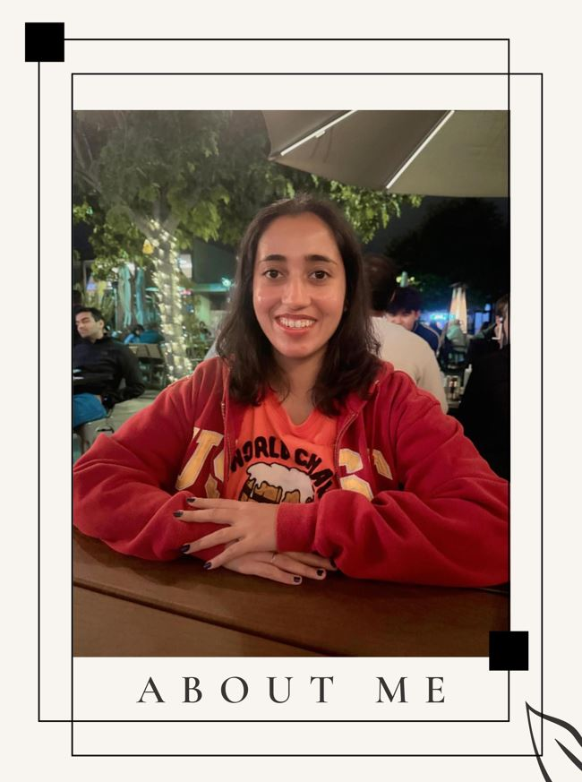

# About Me

Hi, I’m Trishala, a Machine Learning researcher based in California, passionate about building AI solutions that make a real-world impact.
  
My journey into AI began in Mumbai, India, where I earned a Bachelor's degree in Computer Engineering from the University of Mumbai. Fascinated by topics like Machine Learning and data-driven decision-making, I pursued a Master's degree in Applied Data Science at the University of Southern California, specializing in areas like Machine Learning for Data Science, Fairness in AI, Data Mining, and Analysis of Algorithms.
  
From DeepFake bias analysis to predictive models for student well-being, my projects combine technical innovation with ethical responsibility. My goal is to create intelligent, inclusive systems that empower individuals and organizations.
  
Beyond work, I’m a lover of solo travel, museums, and art galleries. On weekends, you’ll find me picnicking in a park or enjoying a musical. I’m also an aspiring Japanese learner and a creative soul who writes poetry and quotes.
  
As I continue to grow in Silicon Valley, I stay committed to lifelong learning, collaboration, and creating impactful solutions. Let’s connect and build something amazing together!

Regards,
 
Trishala Ahalpara
  

