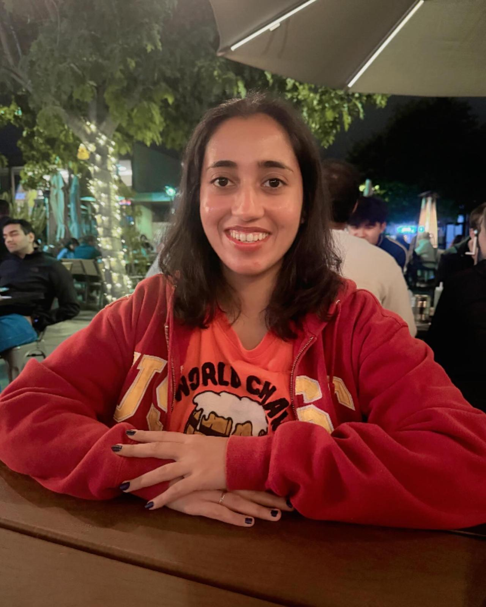

# 👋 About Me

Hi, I’m **Trishala**—a **Machine Learning researcher** based in **California**, passionate about building AI solutions that make a real-world impact. 🌎🤖

---

## 🎓 My Journey
My path into AI started in **Mumbai, India**, where I earned my **Bachelor's degree in Computer Engineering** from the **University of Mumbai**. 📚✨  
Fascinated by **Machine Learning** and **data-driven decision-making**, I pursued a **Master's degree in Applied Data Science** at the **University of Southern California**. There, I specialized in cutting-edge fields like:
- **Machine Learning for Data Science**
- **Fairness in AI** 🏛️
- **Data Mining** 🔍
- **Analysis of Algorithms** 💻

---

## 🔍 My Work
From analyzing **DeepFake bias** to creating **predictive models** for student well-being, my projects combine **technical innovation** with **ethical responsibility**. 🚀💡 My goal is to create **intelligent, inclusive systems** that empower both individuals and organizations. 🌱

---

## 🌍 A Little More About Me
When I’m not immersed in AI, I’m exploring the world through **solo travel**, visiting **museums**, and enjoying **art galleries**. 🎨 On weekends, you’ll find me relaxing with a **picnic** or enjoying a **musical**. 🎭 I’m also an **aspiring Japanese learner** and a creative soul who loves to write **poetry** and **quotes**. ✍️

As I continue to grow here in **Silicon Valley**, I remain committed to **lifelong learning**, **collaboration**, and **creating impactful solutions**. Let's connect and build something amazing together! 🚀

---

## 🤝 Get in Touch!

Feel free to reach out via:

- 📧 **Email**: [trishala.ahalpara@gmail.com](mailto:trishala.ahalpara@gmail.com)
- 💼 **LinkedIn**: [linkedin.com/in/tahalpara](https://www.linkedin.com/in/tahalpara/)

---

  

