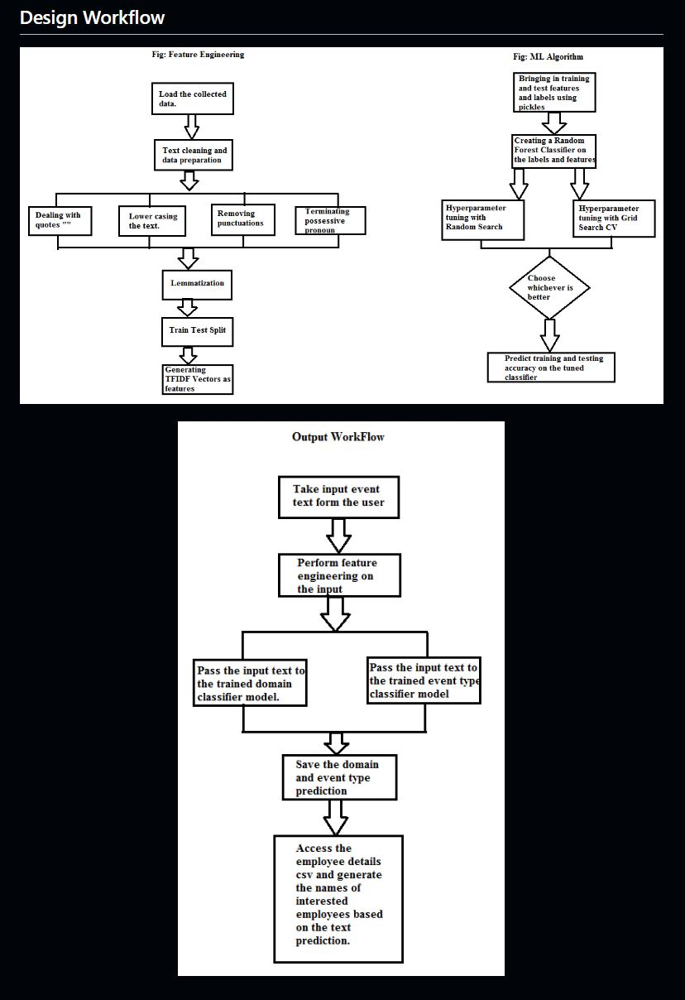

# Event Recommendation System using NLP and Machine Learning Technology

-	**Project Years:** 03/2020 to 08/2020

-	**Project Conducted as part of:** Internship project with Cloud Counselage

-	**Description of project:** 
The Event Recommendation System is an innovative solution leveraging Natural Language Processing (NLP) and Machine Learning to streamline event suggestions for employees. The system processes event details from a CSV file, using the TFIDF algorithm for feature extraction and a Random Forest Classifier to predict the domain and type of each event. Based on these predictions, it matches the events to employees whose preferences align with the predicted domains. Trained on a diverse dataset sourced from platforms like Coursera and event websites, this model efficiently automates event classification and personalizes recommendations for 185 employees, ensuring only relevant events are suggested to everyone.

## Technologies Used

- **Languages**: Python
- **Libraries**: Scikit-learn, TFIDF, Random Forest Classifier
- **Tools**: Pandas, Numpy

## Project outcome: 
The Event Recommendation System successfully delivered an Event Type and Domain Classification Model, significantly enhancing how employees prioritize and register for relevant events. By automatically classifying events based on type and domain, the system empowers employees to focus on opportunities that align with their expertise. The model effectively processes event descriptions, predicts their domain, and curates a personalized list of employees likely to be interested, enabling a tailored event experience. This solution not only streamlines event discovery but also ensures that each employee receives relevant recommendations, maximizing engagement and professional growth.

## Significance in the field of endeavor: 
The significance of the Event Recommendation System in the field of data science and machine learning lies in its ability to automate personalized event recommendations within organizations. By leveraging NLP and machine learning models, it simplifies the task of curating relevant opportunities based on employees' expertise and interests. This system not only saves time but also enhances professional development by ensuring that employees are exposed to events that directly benefit their growth. Moreover, it showcases how predictive models can be applied to real-world scenarios, demonstrating the power of AI in driving efficiency and personalization in corporate settings.

-	Project Github Page: https://github.com/trystine/Event-Recommendation-System-using-NLP-and-Machine-Learning

