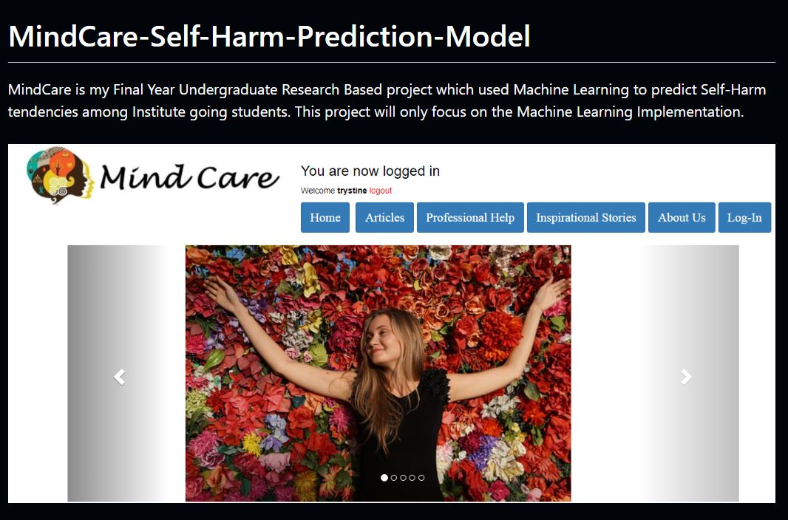

# MindCare-Self-Harm Prediction Model

-	**Project Years:** 06/2019 to 09/2020

-	**Project Conducted as part of:** Final Year Research Project for Bachelor’s in Computer Engineering at University of Mumbai.

**Description of project:** 
o	This research project addresses the prevalence of psychological disorders, specifically self-harm and depression, among institute-going students aged 15-30. Conducted with the validation and recommendation of a professional psychiatrist, the study develops a predictive model to identify self-harm tendencies. Utilizing a dataset of 353 students, seven machine learning algorithms were applied, with the Random Forest algorithm demonstrating the highest accuracy and a low false-positive rate. Feature selection reduced the initial 25 attributes to 13 using the Random Forest classifier's feature importance method. The model was trained through Stratified K-Fold sampling and hyperparameter optimization via Grid Search CV, culminating in a user-interactive web application for real-time prediction.

## Technologies Used
HTML5, CSS, PHP, Flask, Scikit-Learn, Supervised Learning, Data Visualization, SQL, XAMPP

## Project outcome: 
The research yielded a robust machine learning model capable of accurately predicting self-harm tendencies among students, validated by a comprehensive confusion matrix with high accuracy and a low false-positive rate. This tool can significantly aid universities in identifying at-risk students early, enabling timely interventions to enhance mental health support and foster a culture of well-being on campus. The findings are documented in two published papers:
- “Self-Harm Prediction Model Using Machine Learning Technology” – International Journal of Future Generation Communication and Networking.
- “Literature Review on Self-Harm and Suicidal Tendencies using Machine Learning Technology” – Samriddhi Journals.

## Significance in the field of endeavor: 
This project significantly contributes to early diagnosis and intervention strategies for self-harm, reducing the risk of suicide among students. The user-interactive web application enhances accessibility for timely intervention. It also lays the groundwork for future studies on psychological disorders using multi-classification approaches, integrating medical features, and exploring advanced algorithms like Gradient Boosting and Neural Networks. The insights gained can inform educational institutions and mental health organizations, fostering proactive support for student mental health.

-	**Research Paper:** 
- [“Literature Review on Self-Harm and Suicidal Tendencies using Machine Learning Technology” – Samriddhi Journals.](
https://www.smsjournals.com/index.php/SAMRIDDHI/article/view/1926/855)
- [“Self-Harm Prediction Model Using Machine Learning Technology” – International Journal of Future Generation Communication and Networking.](https://www.academia.edu/download/112785649/9013.pdf)

- [Github Link of Project](https://github.com/trystine/MindCare-Self-Harm-Prediction-Model.git)

