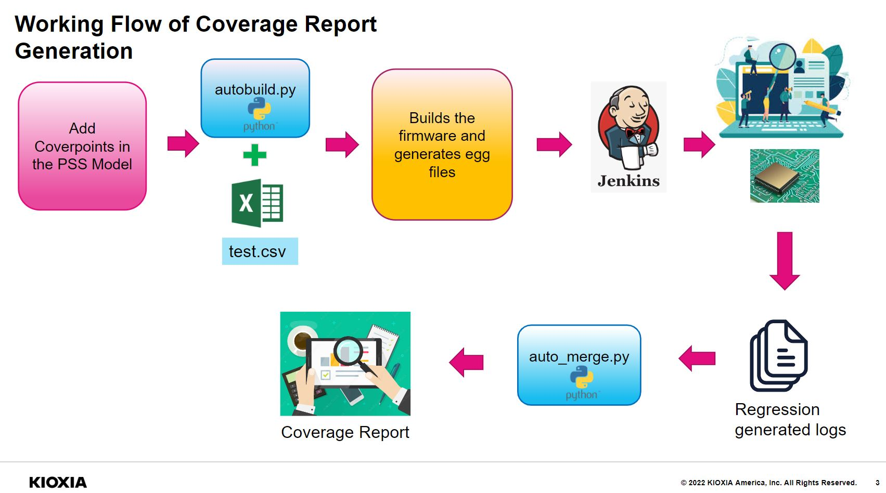

# Sequential Coverage Analysis of Flash Memory Subsystem

-	**Project Years:** 06/2022 to 08/2022

-	**Project Conducted as part of:** Internship Employment with Kioxia America Inc

**Description of project:** 
  - The project aimed to perform a comprehensive coverage analysis and generate a detailed report for the XD7 FSS system, while also validating the functionality of the VC_2.6 Request Packets. This involved assessing the extent to which verification objectives were met by tracking and analyzing the percentage of covered verification points.

  - Using a sequence of Request Packets (RPs), we mapped the number of legal sequences hit and successfully covered. To achieve this, logical coverage points were embedded into the C++ firmware code. The experiment was conducted with the Perspec tool, a sophisticated software-driven SoC (System-on-Chip) verification solution. Additionally, regression testing was integrated into the process using Jenkins, where I developed a custom Python script to automate the coverage analysis and streamline the connection of all essential components. This automation ensured an efficient and scalable process for verifying system coverage.

## Technologies Used
Python, C++, Jenkins, Regression, Seaborn, Perspec

## Project outcome: 
- Initially, a Counter System and Rule-Based Analysis were used, which struggled with the increasing data complexity. Overnight regression tests generated a substantial volume of data, approximately 3 million Request Packets (RPs), which posed significant challenges. Additionally, there was a lack of sequential and cross-coverage of supported features, limiting the analysis scope.

- To overcome these challenges, the Perspec tool was introduced to accurately measure the coverage of all Request Packets. A robust mechanism was developed to track and report sequences of 3 RPs. This allowed for comprehensive analysis across combinations of Request Packets, significantly improving coverage. For example, with 9 RPs, the Perspec Model generated 729 possible combinations (9x9x9), enabling deeper insights and better optimization.

- This outcome shows how the solution enhanced the coverage analysis and addressed critical data handling limitations.

## Significance in the field of endeavor: 
- The solution using the Perspec tool enhances large-scale data analysis by addressing sequential and cross-coverage challenges in Request Packet processing. It sets a new industry standard for efficient and comprehensive coverage, with broad applications across sectors reliant on complex data interactions
- The methodology I developed was handed over to the principal engineer for planned integration into future projects, including DMX. While full implementation was not completed during my tenure, the solution was designed to enhance visual representation of coverage reports, allowing users to access key insights without opening the Perspec GUI. The project’s future use is expected to streamline tracking and analysis of Request Packets, improving system performance and testing efficiency.
- 
-	**Project Presentation:** [https://drive.google.com/drive/folders/14kEWJa3UCKIv_u6UAy6OdekkyfmSEUk5?usp=sharing](https://docs.google.com/presentation/d/1jpUN13ZJ-VdWxxyIx46j8P_YImacKu98/edit?usp=sharing&ouid=105853532295516709139&rtpof=true&sd=true)

